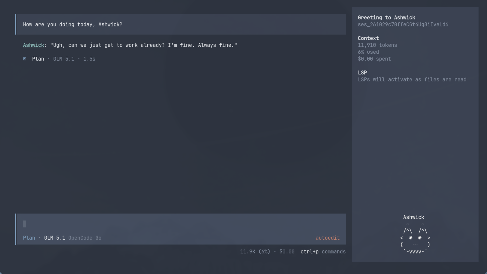

# OpenCode Buddy

**OpenCode Buddy** adds a digital companion to OpenCode cryptographically tied to your specific device. On first launch you'll get one of 18 buddies with a rarity, unique name, and personality that influence its behavior.



# Features
- **Deterministic Engine:** Based on a lightning-fast Mulberry32 PRNG, the unique combination of your username and hostname will always hatch the same unique buddy.
- **Rarities and Stats:** Hatch one of 18 unique ASCII species ranging from `Common` to `Legendary` with stats that influence and determine its personality.
- **Buddy Responses:** See your buddy respond to your work with messages influenced by its unique personality, injected into the system prompt.
- **TUI Integration:** A lively, fidgeting animation widget injected directly into the OpenCode interface.
- **Import and Export Your Buddy:** Your buddy's stats live in a file in your config directory. Use `/buddyimport` and `/buddyexport` to move your favorite buddy to a new machine or trade with your friends. Don't try to edit your buddy's cryptographically derived stats or it'll become corrupted!
- **Interactive Slash Commands:** Run `/buddyfeed` `/buddypet` straight from your terminal to keep your companion happy.

# Installation
Since this is an OpenCode plugin, no complex global installation is required.

Clone this repository into your `~/.config/opencode/` directory:
```
git clone https://github.com/whamram/opencode-buddy.git
```

OpenCode manages its global plugins via a central package.json located at ~/.config/opencode/

To install the buddy plugin globally to your OpenCode:
```
opencode plugin ~/.config/opencode/opencode-buddy/ --global
```

# Usage
Simply write your code and prompt as usual! When you trigger errors, your buddy's personality will reflect in the AI's response.

# Roadmap
- [ ] XP system to upgrade your buddy over time, unlocking hats and increasing its rarity.
- [ ] Cloud signing system to sign your buddy for trading.

#### License
This project is licensed under the [MIT License](LICENSE).

Based on the original work by [@azinak](https://github.com/azinak).
